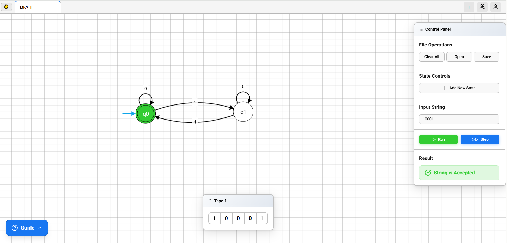
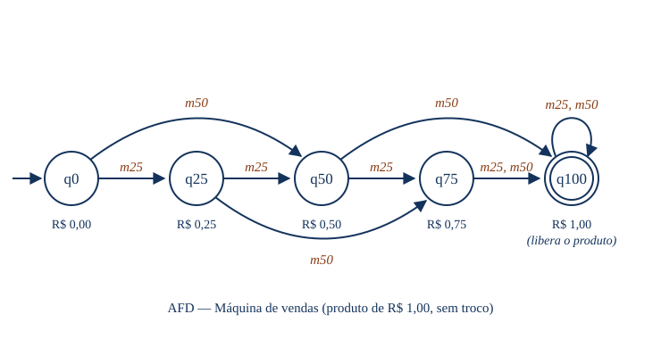

# Lista de Exercícios — Autômatos Finitos Determinísticos (AFD)

Disciplina: Teoria das Linguagens e Autômatos
Turma: Ciência da Computação N1 — 6º semestre
Data: 08/09/2027

Integrantes:
- Luís Filipe Silva Santos
- Luana Stoinski

---

## Parte 1 — Fundamentos

### Exercício 1 — A lâmpada

1. Dois estados: Desligado e Ligado.
2. Estado inicial: Desligado (a lâmpada começa apagada).
3. A entrada `pressionar` (o botão) provoca a transição.
4. Após um acionamento, partindo de Desligado: Ligado.
5. Após dois acionamentos, partindo de Desligado: Desligado (volta ao início).
6. O sistema tem dois estados e uma única entrada. Cada vez que o botão é pressionado, o estado alterna: apagada vira acesa, acesa vira apagada. Como só há duas situações e o próximo estado é sempre único, o comportamento é determinístico.

### Exercício 2 — Porta automática

Tabela de transição:

| Estado atual | Entrada | Próximo estado |
|---|---|---|
| Fechado | pessoa_detectada | Aberto |
| Fechado | nenhuma_pessoa | Fechado |
| Aberto | pessoa_detectada | Aberto |
| Aberto | nenhuma_pessoa | Fechado |

Estado inicial: Fechado.

Diagrama (texto):

```
início → Fechado
Fechado --pessoa_detectada--> Aberto
Fechado --nenhuma_pessoa--> Fechado
Aberto  --pessoa_detectada--> Aberto
Aberto  --nenhuma_pessoa--> Fechado
```

A entrada define diretamente o estado: `pessoa_detectada` sempre leva a Aberto e `nenhuma_pessoa` sempre leva a Fechado, não importa de onde. Quando a porta já está no estado pedido, ela permanece (laços).

---

## Parte 2 — Anatomia e definição formal

### Exercício 3 — Identificando os elementos

AFD dado: Σ={0,1}, Q={q0,q1}, inicial q0, final q1, com transições
q0:(0→q0, 1→q1) e q1:(0→q0, 1→q1).

1. Σ = {0,1} — alfabeto: os símbolos que podem ser lidos na entrada.
2. Q = {q0, q1} — as situações possíveis da máquina.
3. Estado inicial: q0.
4. F = {q1} — conjunto de estados de aceitação.
5. Símbolos que podem ser lidos: 0 e 1.
6. Círculo duplo no diagrama: indica estado final (de aceitação).
7. Seta sem origem: indica o estado inicial.

Observação: como o estado final depende só do último símbolo lido (1 leva a q1, 0 leva a q0), esse AFD aceita as cadeias que terminam em 1.

### Exercício 4 — A quíntupla

| Elemento | Significado |
|---|---|
| Σ | Alfabeto: conjunto finito de símbolos de entrada. |
| Q | Conjunto finito de estados. |
| δ | Função de transição: dado (estado, símbolo), devolve o próximo estado. |
| q0 | Estado inicial (pertence a Q). |
| F | Conjunto de estados finais/de aceitação (subconjunto de Q). |

Por que bastam cinco elementos: eles respondem a tudo o que é preciso para processar uma cadeia. q0 diz onde começar; Σ diz o que pode ser lido; Q diz quais situações existem; δ diz como mudar de estado a cada símbolo (e num AFD é sempre único, sem ambiguidade); F diz quando aceitar. Não sobra nenhuma decisão em aberto, então o comportamento fica totalmente definido.

---

## Parte 3 — Tabela de transições e cadeias

### Exercício 5 — Interpretando uma tabela

AFD: Σ={0,1}, Q={q0,q1,q2}, inicial q0, F={q1}.

| δ | 0 | 1 |
|---|---|---|
| q0 | q0 | q1 |
| q1 | q2 | q1 |
| q2 | q1 | q1 |

1. δ(q0,0) = q0
2. δ(q0,1) = q1
3. δ(q1,0) = q2
4. δ(q2,1) = q1
5. Estado de aceitação: q1.

6. Diagrama (texto):

```
início → q0
q0 --0--> q0     q0 --1--> q1
q1 --0--> q2     q1 --1--> q1
q2 --0--> q1     q2 --1--> q1
Final: q1
```

7. É determinístico porque para cada estado e cada símbolo há exatamente uma transição: nenhuma célula da tabela está vazia e nenhuma tem duas opções. O próximo estado é sempre único.

### Exercício 6 — Aceita ou rejeita?

Usando o AFD do Exercício 5.

a) 1
```
q0 --1--> q1
```
Final: q1 → ACEITA

b) 0011001
```
q0 --0--> q0
q0 --0--> q0
q0 --1--> q1
q1 --1--> q1
q1 --0--> q2
q2 --0--> q1
q1 --1--> q1
```
Final: q1 → ACEITA

c) 010010
```
q0 --0--> q0
q0 --1--> q1
q1 --0--> q2
q2 --0--> q1
q1 --1--> q1
q1 --0--> q2
```
Final: q2 → REJEITA

d) 1101
```
q0 --1--> q1
q1 --1--> q1
q1 --0--> q2
q2 --1--> q1
```
Final: q1 → ACEITA

e) 000011010
```
q0 --0--> q0
q0 --0--> q0
q0 --0--> q0
q0 --0--> q0
q0 --1--> q1
q1 --1--> q1
q1 --0--> q2
q2 --1--> q1
q1 --0--> q2
```
Final: q2 → REJEITA

Resumo:

| Cadeia | Estado final | Resultado |
|---|---|---|
| 1 | q1 | ACEITA |
| 0011001 | q1 | ACEITA |
| 010010 | q2 | REJEITA |
| 1101 | q1 | ACEITA |
| 000011010 | q2 | REJEITA |

---

## Parte 4 — Construção de AFDs

### Exercício 7 — Cadeias que terminam em 1

Ideia: preciso lembrar apenas qual foi o último símbolo lido. Dois estados: q0 (último símbolo não foi 1 / ainda não li nada) e q1 (último símbolo foi 1). Aceito se terminar em q1.

Definição formal:
- Σ = {0,1}
- Q = {q0, q1}
- inicial: q0
- F = {q1}

Tabela:

| δ | 0 | 1 |
|---|---|---|
| q0 | q0 | q1 |
| q1 | q0 | q1 |

Diagrama (texto):

```
início → q0
q0 --0--> q0     q0 --1--> q1
q1 --0--> q0     q1 --1--> q1
Final: q1
```

Ler 1 sempre leva a q1; ler 0 sempre leva a q0. Então o estado final reflete o último símbolo.

Testes:

| Cadeia | Caminho | Final | Resultado |
|---|---|---|---|
| 1 | q0→q1 | q1 | ACEITA |
| 01 | q0→q0→q1 | q1 | ACEITA |
| 101 | q0→q1→q0→q1 | q1 | ACEITA |
| 10 | q0→q1→q0 | q0 | REJEITA |
| 100 | q0→q1→q0→q0 | q0 | REJEITA |
| ε | (não lê nada) | q0 | REJEITA |

### Exercício 8 — Número par de símbolos 1

Ideia: basta controlar a paridade da quantidade de 1s. Dois estados: P (par de 1s) e I (ímpar de 1s). Ler 0 não muda nada; ler 1 alterna. Zero 1s é par, então começo em P, que também é o estado de aceitação.

Definição formal M = (Σ, Q, δ, q0, F):
- Σ = {0,1}
- Q = {P, I}
- q0 = P
- F = {P}

Tabela:

| δ | 0 | 1 |
|---|---|---|
| P | P | I |
| I | I | P |

Diagrama (texto):

```
início → P
P --0--> P     P --1--> I
I --0--> I     I --1--> P
Final: P
```

Processamento das cadeias pedidas:

| Cadeia | Caminho | Final | Qtd de 1s | Resultado |
|---|---|---|---|---|
| ε | (não lê nada) | P | 0 (par) | ACEITA |
| 0 | P→P | P | 0 (par) | ACEITA |
| 1 | P→I | I | 1 (ímpar) | REJEITA |
| 11 | P→I→P | P | 2 (par) | ACEITA |
| 101 | P→I→I→P | P | 2 (par) | ACEITA |
| 1100 | P→I→P→P→P | P | 2 (par) | ACEITA |
| 10101 | P→I→I→P→P→I | I | 3 (ímpar) | REJEITA |

### Exercício 9 — Pelo menos dois zeros consecutivos

Respostas antes de construir:
1. O estado inicial representa "ainda não vi nenhum 0 (ou o último símbolo não foi 0)".
2. Ao aparecer o primeiro 0, vou para um estado que marca "acabei de ver um 0".
3. Se vier outro 0 logo em seguida, encontrei 00 e vou para o estado de aceitação.
4. Não. Depois de encontrar 00, a cadeia já é aceita e continua aceita até o fim, independentemente do que venha depois (o estado final é uma "armadilha" que não se sai mais).
5. Três estados são necessários.

Estados:
- q0: nenhum 0 pendente (último símbolo não foi 0)
- q1: acabei de ver um 0 (um 0 pendente)
- q2: já vi 00 (aceitação, e fica preso aqui)

Definição formal M = (Σ, Q, δ, q0, F):
- Σ = {0,1}
- Q = {q0, q1, q2}
- q0 = q0
- F = {q2}

Tabela:

| δ | 0 | 1 |
|---|---|---|
| q0 | q1 | q0 |
| q1 | q2 | q0 |
| q2 | q2 | q2 |

Explicação das transições: em q0, um 1 mantém em q0 e um 0 vai para q1. Em q1 (um 0 pendente), outro 0 fecha o 00 e vai para q2; mas um 1 quebra a sequência e volta para q0. Em q2, tudo mantém em q2 (já aceitou).

Diagrama (texto):

```
início → q0
q0 --0--> q1     q0 --1--> q0
q1 --0--> q2     q1 --1--> q0
q2 --0--> q2     q2 --1--> q2
Final: q2
```

Testes:

| Cadeia | Caminho | Final | Resultado |
|---|---|---|---|
| 00 | q0→q1→q2 | q2 | ACEITA |
| 001 | q0→q1→q2→q2 | q2 | ACEITA |
| 100 | q0→q0→q1→q2 | q2 | ACEITA |
| 1001 | q0→q0→q1→q2→q2 | q2 | ACEITA |
| 110011 | q0→q0→q0→q1→q2→q2→q2 | q2 | ACEITA |
| 0000 | q0→q1→q2→q2→q2 | q2 | ACEITA |
| ε | (não lê nada) | q0 | REJEITA |
| 0 | q0→q1 | q1 | REJEITA |
| 1 | q0→q0 | q0 | REJEITA |
| 01 | q0→q1→q0 | q0 | REJEITA |
| 10 | q0→q0→q1 | q1 | REJEITA |
| 10101 | q0→q0→q1→q0→q1→q0 | q0 | REJEITA |

---

## Parte 5 — Desafios de modelagem

### Exercício 10 — Semáforo

Estados: Verde, Amarelo, Vermelho. Entrada única: `tempo` (a passagem de tempo faz avançar no ciclo).

Definição formal M = (Σ, Q, δ, q0, F):
- Σ = {tempo}
- Q = {Verde, Amarelo, Vermelho}
- q0 = Verde
- F = {} (nenhum estado de aceitação — ver justificativa)

Tabela:

| δ | tempo |
|---|---|
| Verde | Amarelo |
| Amarelo | Vermelho |
| Vermelho | Verde |

Diagrama (texto):

```
início → Verde
Verde --tempo--> Amarelo
Amarelo --tempo--> Vermelho
Vermelho --tempo--> Verde
```

Funcionamento: a cada intervalo de tempo o semáforo avança para a próxima cor, num ciclo Verde → Amarelo → Vermelho → Verde, que se repete indefinidamente.

Sobre estados de aceitação: aqui não faz sentido definir estados finais. Um AFD com F serve para decidir se uma cadeia é aceita ou rejeitada; o semáforo não "processa uma palavra para dar um veredito", ele apenas modela um comportamento cíclico contínuo que nunca termina. Por isso F fica vazio: o objetivo é representar as transições de estado, não reconhecer uma linguagem.

### Exercício 11 — Sistema de login

Entradas: senha_correta e senha_incorreta. Uma senha correta autentica; três senhas incorretas bloqueiam.

Resposta à pergunta: não, apenas Aguardando, Autenticado e Bloqueado não bastam. É preciso contar quantas tentativas erradas já ocorreram, e para isso precisamos de estados intermediários (0, 1 e 2 erros). Sem eles, o autômato não teria como "lembrar" quantas vezes o usuário já errou para decidir quando bloquear.

Estados:
- S0: aguardando, 0 erros (inicial)
- S1: 1 erro
- S2: 2 erros
- Autenticado: login bem-sucedido
- Bloqueado: 3 erros (travado)

Definição formal M = (Σ, Q, δ, q0, F):
- Σ = {senha_correta, senha_incorreta}
- Q = {S0, S1, S2, Autenticado, Bloqueado}
- q0 = S0
- F = {Autenticado}

Tabela:

| δ | senha_correta | senha_incorreta |
|---|---|---|
| S0 | Autenticado | S1 |
| S1 | Autenticado | S2 |
| S2 | Autenticado | Bloqueado |
| Autenticado | Autenticado | Autenticado |
| Bloqueado | Bloqueado | Bloqueado |

Diagrama (texto):

```
início → S0
S0 --senha_incorreta--> S1
S1 --senha_incorreta--> S2
S2 --senha_incorreta--> Bloqueado
S0/S1/S2 --senha_correta--> Autenticado
Autenticado --qualquer--> Autenticado
Bloqueado --qualquer--> Bloqueado
Final: Autenticado
```

Comportamento: enquanto o usuário erra, sobe de S0 para S1, S2 e, no terceiro erro, Bloqueado. Uma senha correta em qualquer estado ainda "vivo" (S0, S1, S2) leva a Autenticado. Autenticado e Bloqueado são estados finais de comportamento (armadilhas): uma vez autenticado, continua autenticado; uma vez bloqueado, continua bloqueado. Só Autenticado é estado de aceitação.

---

## Parte 6 — Prática no simulador

### Exercício 12 — Implementação e testes

Simulador utilizado: Automataverse (automataverse.com/simulator).
AFD escolhido: Exercício 8 (número par de símbolos 1). Os estados P e I foram nomeados como q0 e I no simulador, sendo q0 o estado inicial e final.

Passos feitos no simulador:
1. Criados os dois estados (q0 = par, inicial e final; q1 = ímpar).
2. q0 definido como inicial e final.
3. Criadas as transições conforme a tabela do Exercício 8 (laço 0 em cada estado; 1 alterna entre eles).
4. Testadas cadeias que devem ser aceitas e rejeitadas.

Tabela de testes:

| Cadeia | Resultado esperado | Resultado no simulador | Conferência |
|---|---|---|---|
| 11 | ACEITA | ACEITA | OK |
| 1100 | ACEITA | ACEITA | OK |
| 0 | ACEITA | ACEITA | OK |
| 1 | REJEITA | REJEITA | OK |
| 10101 | REJEITA | REJEITA | OK |

Print do AFD:



Explicação: o AFD tem dois estados que representam a paridade da quantidade de 1s. O símbolo 0 nunca muda o estado; o símbolo 1 alterna entre par e ímpar. Como o estado inicial também é final, cadeias com quantidade par de 1s (incluindo zero) terminam no estado de aceitação e são aceitas.

---

## Desafio final

### Exercício 13 — Crie seu próprio problema

Situação escolhida: **máquina de vendas (vending machine) de refrigerante**.

#### 1. Descrição do problema e suas regras

A máquina vende um único produto, que custa **R$ 1,00**. O cliente vai inserindo moedas até completar o valor; quando o crédito acumulado chega a R$ 1,00, a máquina libera o produto.

Regras adotadas:

- A máquina aceita apenas moedas de **R$ 0,25** e **R$ 0,50**.
- O crédito acumulado é somado a cada moeda inserida.
- Enquanto o crédito for menor que R$ 1,00, a máquina apenas aguarda a próxima moeda e não entrega nada.
- Ao atingir **R$ 1,00 ou mais**, a máquina libera o produto imediatamente.
- A máquina **não dá troco**: se o cliente inserir moedas que ultrapassem R$ 1,00 (por exemplo, R$ 0,75 + R$ 0,50 = R$ 1,25), o produto é liberado e o excedente fica retido.
- Depois que o produto é liberado, a compra está concluída: qualquer moeda inserida a mais é retida e o estado não muda mais (estado-armadilha).

Uma "cadeia de entrada" é, portanto, a sequência de moedas inseridas pelo cliente, e a máquina **aceita** essa sequência quando ela é suficiente para pagar o produto.

#### 2. Entradas e estados

**Entradas (alfabeto):** os dois tipos de moeda aceitos.

| Símbolo | Significado |
|---|---|
| `m25` | inserir moeda de R$ 0,25 |
| `m50` | inserir moeda de R$ 0,50 |

**Estados:** cada estado representa o crédito já acumulado. Como as moedas são múltiplos de R$ 0,25 e o preço é R$ 1,00, só existem cinco situações possíveis de crédito.

| Estado | Significado |
|---|---|
| q0 | crédito de R$ 0,00 (nenhuma moeda inserida) |
| q25 | crédito de R$ 0,25 |
| q50 | crédito de R$ 0,50 |
| q75 | crédito de R$ 0,75 |
| q100 | crédito de R$ 1,00 ou mais — produto liberado |

#### 3. Estado inicial e estados finais

- **Estado inicial:** q0 — a máquina começa sem crédito nenhum.
- **Estado final (de aceitação):** q100 — é o único estado em que o produto é liberado, ou seja, em que a sequência de moedas é considerada válida/suficiente.

#### 4. Tabela de transições

| δ | m25 | m50 |
|---|---|---|
| q0 | q25 | q50 |
| q25 | q50 | q75 |
| q50 | q75 | q100 |
| q75 | q100 | q100 |
| q100 | q100 | q100 |

Observações sobre a tabela:

- Em q75, tanto `m25` (que fecha exatamente R$ 1,00) quanto `m50` (que daria R$ 1,25) levam a q100, porque a máquina não dá troco e o produto é liberado do mesmo jeito.
- q100 é uma armadilha: depois da venda concluída, nenhuma moeda altera o estado.

#### 5. Diagrama do AFD



Diagrama (texto):

```
início → q0

q0   --m25--> q25      q0   --m50--> q50
q25  --m25--> q50      q25  --m50--> q75
q50  --m25--> q75      q50  --m50--> q100
q75  --m25--> q100     q75  --m50--> q100
q100 --m25--> q100     q100 --m50--> q100

Final: q100 (círculo duplo)
```

#### 6. Definição formal M = (Σ, Q, δ, q0, F)

- **Σ** = {m25, m50}
- **Q** = {q0, q25, q50, q75, q100}
- **q0** = q0
- **F** = {q100}
- **δ: Q × Σ → Q**, dada por:

```
δ(q0,   m25) = q25      δ(q0,   m50) = q50
δ(q25,  m25) = q50      δ(q25,  m50) = q75
δ(q50,  m25) = q75      δ(q50,  m50) = q100
δ(q75,  m25) = q100     δ(q75,  m50) = q100
δ(q100, m25) = q100     δ(q100, m50) = q100
```

#### 7. Testes de sequências de entrada

| # | Sequência de entrada | Caminho percorrido | Total inserido | Estado final | Resultado |
|---|---|---|---|---|---|
| 1 | m50 m50 | q0→q50→q100 | R$ 1,00 | q100 | ACEITA |
| 2 | m25 m25 m25 m25 | q0→q25→q50→q75→q100 | R$ 1,00 | q100 | ACEITA |
| 3 | m25 m25 m50 | q0→q25→q50→q100 | R$ 1,00 | q100 | ACEITA |
| 4 | m50 m25 m50 | q0→q50→q75→q100 | R$ 1,25 | q100 | ACEITA (sem troco) |
| 5 | m25 m50 | q0→q25→q75 | R$ 0,75 | q75 | REJEITA |
| 6 | m25 m25 m25 | q0→q25→q50→q75 | R$ 0,75 | q75 | REJEITA |
| 7 | m50 | q0→q50 | R$ 0,50 | q50 | REJEITA |
| 8 | m50 m50 m25 | q0→q50→q100→q100 | R$ 1,25 | q100 | ACEITA (moeda extra retida) |
| 9 | ε (nenhuma moeda) | (não lê nada) | R$ 0,00 | q0 | REJEITA |

Detalhamento do teste 4 (`m50 m25 m50`):

```
q0  --m50--> q50     (crédito R$ 0,50)
q50 --m25--> q75     (crédito R$ 0,75)
q75 --m50--> q100    (crédito R$ 1,25 → libera o produto, sem troco)
```
Final: q100 → ACEITA

Detalhamento do teste 5 (`m25 m50`):

```
q0  --m25--> q25     (crédito R$ 0,25)
q25 --m50--> q75     (crédito R$ 0,75)
```
Final: q75 → REJEITA (falta crédito, a máquina continua esperando)

#### 8. Por que o modelo é determinístico

O modelo atende a todas as condições de um AFD:

1. **Nenhuma célula da tabela está vazia.** São 5 estados × 2 símbolos = 10 transições, e todas as 10 estão definidas. A função δ é total: de qualquer estado, qualquer moeda válida tem destino.
2. **Nenhuma célula tem mais de um destino.** Para cada par (estado, moeda) existe exatamente um próximo estado — não há escolha nem ambiguidade.
3. **Não existem transições vazias (ε).** A máquina só muda de estado quando uma moeda é efetivamente inserida.
4. **Não há aleatoriedade nem memória externa.** O próximo estado depende apenas do crédito atual e da moeda lida, então processar a mesma sequência de moedas leva sempre exatamente ao mesmo resultado.

Na prática isso significa que dois clientes que inserirem a mesma sequência de moedas terão sempre o mesmo comportamento da máquina — que é justamente o que se espera de um equipamento confiável.

#### 9. Conclusão

A modelagem da máquina de vendas mostrou que um AFD é uma ferramenta natural para descrever sistemas que precisam "lembrar" apenas de uma informação resumida. Aqui, a máquina não precisa guardar a lista de moedas inseridas nem a ordem delas: basta saber o crédito acumulado. Foi essa observação que permitiu resolver o problema com apenas cinco estados finitos, em vez de tentar representar infinitas sequências possíveis de moedas.

Também ficou claro o papel de cada elemento da quíntupla na modelagem de uma situação real: Σ representa os eventos que o sistema percebe (as moedas), Q representa as situações relevantes (os valores de crédito), δ codifica as regras de negócio (somar o valor da moeda), q0 é o ponto de partida (máquina zerada) e F identifica o objetivo alcançado (produto liberado).

Outro ponto importante foi perceber que decisões de projeto viram estados e transições concretas. A regra "a máquina não dá troco" apareceu no autômato como duas setas diferentes (`m25` e `m50` a partir de q75) chegando ao mesmo estado q100, e a regra "a compra está concluída" apareceu como o laço em q100 — a mesma ideia de estado-armadilha já usada nos Exercícios 9 e 11. Isso reforça que padrões de modelagem se repetem entre problemas aparentemente distintos.

Por fim, o determinismo ficou evidente na prática: como toda combinação de estado e entrada tem uma única saída definida, o comportamento do sistema é totalmente previsível e pode ser verificado exaustivamente — uma propriedade desejável em qualquer sistema que precise ser confiável, como máquinas de venda, catracas, controles de acesso ou protocolos de comunicação.
