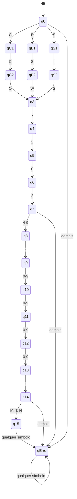

# Aula 05 — Expressões Regulares — Atividades Resolvidas


## Parte 8 — Exercício guiado

### Exercício 1 — Sufixo `00`

**Alfabeto:** Σ = {0, 1}

**Linguagem:** L = { w ∈ {0,1}\* | w termina em `00` }

**Blocos da palavra:**

| Bloco | Conteúdo | Repetição |
|---|---|---|
| 1 | prefixo qualquer sobre {0,1} | zero ou mais símbolos |
| 2 | `00` literal | exatamente uma vez, no fim |

**ER clássica:** `(0|1)*00`

**Regex prática:** `^[01]*00$`

**Casos de teste:**

| Cadeia | Esperado | Motivo |
|---|---|---|
| `00` | aceita | o prefixo é ε e a palavra já termina em `00` |
| `000` | aceita | prefixo `0` + sufixo `00` |
| `100` | aceita | prefixo `1` + sufixo `00` |
| `10100` | aceita | prefixo `101` + sufixo `00` |
| `0` | rejeita | falta um símbolo para formar o sufixo |
| ε | rejeita | não há sufixo `00` |
| `001` | rejeita | termina em `1` |
| `010` | rejeita | os dois últimos símbolos são `10` |
| `002` | rejeita | `2` não pertence ao alfabeto |

**Observação:** o prefixo usa `*` (e não `+`) porque a própria palavra `00` deve ser aceita, ou seja, o prefixo pode ser vazio.

### Exercício 2 — Exatamente dois `a`

**Alfabeto:** Σ = {a, b}

**Linguagem:** L = { w ∈ {a,b}\* | w contém exatamente dois símbolos `a` }

**Raciocínio:** os dois `a` são obrigatórios e fixos em quantidade; os `b` são livres. Existem exatamente três regiões onde os `b` podem aparecer: antes do primeiro `a`, entre os dois `a` e depois do segundo `a`.

```
b*  a  b*  a  b*
 └┬─┘    └┬─┘   └┬─┘
antes   entre   depois
```

**ER clássica:** `b*ab*ab*`

**Regex prática:** `^b*ab*ab*$`

**Casos de teste:**

| Cadeia | Esperado | Qtd. de `a` |
|---|---|---|
| `aa` | aceita | 2 |
| `baa` | aceita | 2 |
| `aab` | aceita | 2 |
| `bab a` → `baba` | aceita | 2 |
| `bbabbabb` | aceita | 2 |
| ε | rejeita | 0 |
| `a` | rejeita | 1 |
| `bbb` | rejeita | 0 |
| `aaa` | rejeita | 3 |
| `abab` | rejeita | 2 `a`, mas... ver nota |

**Nota sobre `abab`:** essa cadeia possui exatamente dois `a`, então **é aceita** — `a` (`b*` vazio) + `b` + `a` + `b`. Ela serve como bom caso de fronteira para conferir que a expressão não exige que os `b` fiquem agrupados.

**Casos de fronteira importantes:** `aa` (nenhum `b`) e `bbaabb` (`b` nas duas pontas) confirmam que os três blocos `b*` podem ser vazios ou não independentemente.

### Exercício 3 — Identificador acadêmico

**Especificação:** duas letras maiúsculas, três algarismos, opcionalmente uma letra minúscula no fim, sem caracteres extras.

**Blocos:**

| Bloco | Expressão | Repetição |
|---|---|---|
| letras maiúsculas | `[A-Z]` | exatamente 2 → `{2}` |
| algarismos | `[0-9]` | exatamente 3 → `{3}` |
| letra minúscula final | `[a-z]` | zero ou uma → `?` |

**Regex prática:** `^[A-Z]{2}[0-9]{3}[a-z]?$`

**ER clássica equivalente (esboço):** a mesma linguagem pode ser escrita sem quantificadores, expandindo as classes em alternâncias — `(A|B|…|Z)(A|B|…|Z)(0|…|9)(0|…|9)(0|…|9)((a|…|z)|ε)` — o que mostra que `{n}` e `?` são apenas abreviações e não aumentam o poder expressivo.

**Casos de teste:**

| Cadeia | Esperado | Regra verificada |
|---|---|---|
| `LF123` | aceita | sem a letra final opcional |
| `ES456a` | aceita | com a letra final opcional |
| `AB000z` | aceita | fronteira de algarismos |
| `L123` | rejeita | só uma letra maiúscula |
| `LFA123` | rejeita | três letras maiúsculas |
| `LF12` | rejeita | só dois algarismos |
| `LF1234` | rejeita | quatro algarismos |
| `lf123` | rejeita | letras minúsculas no início |
| `LF123A` | rejeita | letra final maiúscula |
| `LF123ab` | rejeita | duas letras finais |

---

## Parte 9 — Desafio final: código de matrícula acadêmica

**Regex:**

```regex
^(CCO|ESW|SIS)-202[4-9]-[0-9]{4}-[MTN]$
```

**ER clássica equivalente:**

```
(CCO|ESW|SIS)-202(4|5|6|7|8|9)-DDDD-(M|T|N)
```
com `D = (0|1|2|3|4|5|6|7|8|9)` repetido quatro vezes.

### Justificativa por blocos

| # | Trecho | Papel na especificação |
|---|---|---|
| 1 | `^` | ancora o início da entrada: nada pode vir antes do curso |
| 2 | `(CCO\|ESW\|SIS)` | alternância entre os três cursos permitidos; os parênteses limitam o alcance do `\|` ao bloco do curso |
| 3 | `-` | hífen literal separando curso e ano |
| 4 | `202[4-9]` | ano entre 2024 e 2029: prefixo fixo `202` + classe restrita aos algarismos 4 a 9 |
| 5 | `-` | segundo hífen literal |
| 6 | `[0-9]{4}` | número sequencial com exatamente quatro algarismos |
| 7 | `-` | terceiro hífen literal |
| 8 | `[MTN]` | turno: exatamente um caractere entre `M`, `T` e `N` |
| 9 | `$` | ancora o fim da entrada: nada pode vir depois do turno |

Cada regra do enunciado virou um bloco da expressão, na mesma ordem em que aparece na especificação. Como não há nenhum operador de repetição envolvendo blocos inteiros, o comprimento de uma palavra válida é **sempre 18 caracteres**.

### Cardinalidade da linguagem

A linguagem é **finita**: 3 cursos × 6 anos × 10⁴ números × 3 turnos = **540.000** códigos válidos. Toda linguagem finita é regular, o que confirma, antes mesmo de escrever a expressão, que o problema é solucionável por uma ER e por um autômato finito.

### Conferência dos casos do enunciado

| Entrada | Esperado | Bloco decisivo |
|---|---|---|
| `CCO-2024-0001-M` | aceita | limite inferior do ano |
| `ESW-2026-1042-N` | aceita | formato geral |
| `SIS-2029-9999-T` | aceita | limite superior do ano e do número |
| `CCO-2027-0100-N` | aceita | formato geral |
| `ESW-2025-4321-M` | aceita | formato geral |
| `ADS-2026-0001-N` | rejeita | `ADS` não está na alternância de cursos |
| `CCO-2030-0001-M` | rejeita | `2030` não casa com `202[4-9]` (o prefixo é `203`) |
| `SIS-2027-123-N` | rejeita | `123` tem 3 algarismos, e `{4}` exige 4 |
| `esw-2026-1042-N` | rejeita | a alternância só contém letras maiúsculas |
| `CCO/2026/0001/M` | rejeita | o separador literal é `-`, não `/` |
| `CCO-2026-0001-X` | rejeita | `X` não pertence à classe `[MTN]` |

### Dois novos casos válidos

1. `SIS-2025-0042-T`
2. `ESW-2028-7777-N`

### Dois novos casos inválidos e motivo

1. `CCO-2026-0001` — falta o terceiro hífen e o bloco de turno; a expressão exige os quatro blocos completos.
2. `CCO--2026-0001-M` — há um hífen a mais entre curso e ano; a expressão prevê exatamente um separador em cada junção.

### Perguntas para justificar

**1. Qual subexpressão representa a escolha entre cursos?**

`(CCO|ESW|SIS)`. Trata-se de uma alternância (união de linguagens) entre três palavras literais, agrupada por parênteses. Sem os parênteses, a expressão `CCO|ESW|SIS-202[4-9]-...` seria lida como três alternativas de toda a expressão — pela precedência, a alternância é o operador mais fraco, então ela absorveria tudo o que estivesse ao seu redor.

**2. Como o intervalo de anos foi limitado sem aceitar `2030`?**

Explorando a estrutura decimal do intervalo. De 2024 a 2029, os três primeiros algarismos são sempre `202`, e apenas o último varia entre 4 e 9. Por isso `202[4-9]` cobre exatamente os seis anos permitidos. `2030` falha já no terceiro algarismo (`3` no lugar de `2`), e `2023` falha no quarto (`3` não pertence a `[4-9]`).

Uma alternativa equivalente e mais explícita seria `(2024|2025|2026|2027|2028|2029)`. A forma escolhida é apenas mais compacta — as duas denotam a mesma linguagem.

**3. Por que `{4}` é diferente de `+` no bloco numérico?**

`{4}` significa **exatamente quatro** ocorrências, enquanto `+` significa **uma ou mais**, sem limite superior. Se o bloco fosse `[0-9]+`, a expressão aceitaria erroneamente `SIS-2027-123-N` (três algarismos), `CCO-2024-1-M` (um algarismo) e `CCO-2024-123456-M` (seis algarismos). Como a especificação fixa o comprimento do bloco, o quantificador exato é obrigatório. Vale notar que `{4}` não amplia o poder expressivo: ele é apenas a abreviação de `[0-9][0-9][0-9][0-9]`.

**4. Qual é a função das âncoras?**

`^` e `$` forçam a correspondência com a **entrada inteira**, e não com um trecho dela. Sem elas, o motor procuraria qualquer subcadeia que casasse com o padrão: a entrada `lixoCCO-2026-0001-Mlixo` seria considerada válida, porque contém um código correto no meio. Como a tarefa é **validar** (e não buscar), a correspondência precisa ser total. Conceitualmente, as âncoras não são operadores da definição clássica de ER — elas descrevem posição no texto e pertencem à sintaxe dos motores; na teoria, a correspondência já é sempre total sobre a palavra.

**5. Sua expressão aceita alguma cadeia que viola as regras?**

Não. A justificativa se apoia em dois pontos:

- **Estrutural:** a expressão é uma concatenação de blocos de comprimento fixo, sem nenhum operador de repetição sobre blocos inteiros e sem `.` ou classes abertas. Toda palavra aceita tem exatamente 18 caracteres, distribuídos na ordem curso–hífen–ano–hífen–número–hífen–turno. Como cada bloco só admite os símbolos listados no enunciado, o conjunto aceito é exatamente o produto cartesiano descrito na definição formal de L.
- **Empírico:** os testes cobrem as três famílias de erro possíveis — símbolo fora do conjunto permitido (`ADS`, `X`, `esw`), comprimento incorreto de bloco (`123`, `12345`) e estrutura/separador incorretos (`/`, hífen duplicado, bloco ausente, caracteres extras nas pontas). Em todos eles o resultado obtido coincidiu com o esperado, incluindo os casos de fronteira `2024`, `2029`, `0000` e `9999`.

O único ponto que a expressão **não** verifica é semântico, não sintático: ela não sabe se o código realmente existe no sistema da universidade, apenas se ele está bem formado. Isso está fora do que uma linguagem regular consegue expressar.

---

## Desafio extra — DFA equivalente

### Ideia geral

Como a linguagem é finita e de comprimento fixo, o DFA é essencialmente uma **cadeia linear de estados**, com ramificações apenas onde a especificação oferece escolha (curso, ano, número e turno) e um **estado sumidouro** para tudo o que fugir do padrão.

O alfabeto de entrada é o conjunto de caracteres imprimíveis. Para manter o desenho legível, as transições são rotuladas por classes (`[0-9]`, `[MTN]`, etc.), e vale a convenção: **de qualquer estado, qualquer símbolo não rotulado explicitamente leva ao sumidouro `qErro`**. Isso garante que δ seja total, como exige a definição de AFD.

### Estados e progresso entre os blocos

| Estado | Significado (o que já foi lido) | Bloco |
|---|---|---|
| q0 | nada (inicial) | — |
| qC1, qC2 | `C`, `CC` | curso — ramo CCO |
| qE1, qE2 | `E`, `ES` | curso — ramo ESW |
| qS1, qS2 | `S`, `SI` | curso — ramo SIS |
| q3 | curso completo (`CCO`, `ESW` ou `SIS`) | fim do bloco 1 |
| q4 | primeiro hífen lido | separador |
| q5, q6, q7 | `2`, `20`, `202` | ano |
| q8 | ano completo (2024–2029) | fim do bloco 2 |
| q9 | segundo hífen lido | separador |
| q10, q11, q12, q13 | 1, 2, 3 e 4 algarismos lidos | número |
| q14 | terceiro hífen lido | separador |
| **q15** | turno lido — **único estado de aceitação** | fim |
| qErro | sumidouro | — |

Total: **21 estados**.

### Tabela de transições

| Estado | Símbolo(s) | Próximo estado |
|---|---|---|
| q0 | `C` / `E` / `S` | qC1 / qE1 / qS1 |
| qC1 | `C` | qC2 |
| qC2 | `O` | q3 |
| qE1 | `S` | qE2 |
| qE2 | `W` | q3 |
| qS1 | `I` | qS2 |
| qS2 | `S` | q3 |
| q3 | `-` | q4 |
| q4 | `2` | q5 |
| q5 | `0` | q6 |
| q6 | `2` | q7 |
| q7 | `[4-9]` | q8 |
| q8 | `-` | q9 |
| q9 | `[0-9]` | q10 |
| q10 | `[0-9]` | q11 |
| q11 | `[0-9]` | q12 |
| q12 | `[0-9]` | q13 |
| q13 | `-` | q14 |
| q14 | `[MTN]` | **q15** |
| q15 | qualquer símbolo | qErro |
| qErro | qualquer símbolo | qErro |
| *(qualquer estado)* | *qualquer símbolo não listado acima* | qErro |

### Diagrama



> As setas para `qErro` estão desenhadas apenas em alguns estados para não poluir o diagrama. Formalmente, **todo** estado possui transição para `qErro` em qualquer símbolo não previsto na tabela.

### Explicações

**Quais estados representam o progresso entre os blocos?**

A sequência q3 → q4 → q8 → q9 → q13 → q14 → q15 marca as fronteiras: q3 encerra o curso, q8 encerra o ano, q13 encerra o número e q15 encerra o turno. Os estados q4, q9 e q14 registram que um hífen separador foi consumido. Os demais estados representam progresso *dentro* de um bloco (quantos caracteres daquele bloco já foram lidos).

**Onde ocorrem as ramificações de curso, ano e turno?**

- **Curso:** a ramificação acontece já em q0, que se divide em três caminhos conforme a primeira letra (`C`, `E` ou `S`). Os três caminhos têm dois estados intermediários cada e **reconvergem em q3**. Essa convergência é importante: a partir de q3 o autômato não precisa mais lembrar qual curso foi lido, porque essa informação não influencia o restante da validação.
- **Ano:** o caminho q4 → q5 → q6 → q7 é forçado (`2`, `0`, `2`), e a única escolha real está na transição q7 → q8, restrita à classe `[4-9]`. É exatamente aqui que `2030` e `2023` são rejeitados.
- **Turno:** a ramificação está na transição q14 → q15, que aceita três símbolos distintos e converge no mesmo estado final.

**Qual é o único estado de aceitação?**

**q15**, alcançado somente depois de consumir os 18 caracteres na ordem correta. Como a linguagem tem comprimento fixo, não faz sentido aceitar em nenhum ponto intermediário: uma palavra parcialmente correta ainda é inválida.

**Por que caracteres adicionais levam à rejeição?**

Porque q15 não possui nenhuma transição de volta para si mesmo nem para qualquer estado útil: qualquer símbolo lido a partir dele leva a qErro, que é um estado-armadilha não final. Assim, `CCO-2024-0001-MM` percorre o caminho correto até q15 e depois cai em qErro ao ler o `M` extra, terminando em estado não aceitador. Esse comportamento é o análogo, no autômato, do papel da âncora `$` na Regex. Da mesma forma, o estado inicial q0 só aceita `C`, `E` ou `S`, de modo que um caractere extra no começo (` CCO-...`) já cai em qErro no primeiro passo — o análogo da âncora `^`.

---

## Parte 10 — Atividade prática no Regex Learn

**Ferramenta:** [Regex Learn Playground](https://regexlearn.com/playground)
**Expressão testada:** `^(CCO|ESW|SIS)-202[4-9]-[0-9]{4}-[MTN]$`
**Flags utilizadas:** `g` (global) e `m` (multiline), de modo que cada linha do texto de teste seja avaliada como uma entrada independente.

### Procedimento executado

1. A expressão foi derivada a partir dos blocos da especificação, antes de qualquer teste na ferramenta.
2. Os cinco exemplos que devem ser aceitos foram inseridos no painel de texto, um por linha.
3. Os seis exemplos que devem ser rejeitados foram inseridos logo abaixo.
4. Foram criados quatro casos adicionais: um em cada limite do intervalo de anos, um inválido "quase correto" e um inválido com caractere extra.
5. Conferiu-se quais linhas foram destacadas pelo motor (correspondência encontrada = aceita) e quais não foram (rejeitada).

### Registro dos testes

| Entrada | Esperado | Obtido | Regra verificada |
|---|---|---|---|
| `CCO-2024-0001-M` | aceita | aceita | curso, limite inferior e formato |
| `ESW-2026-1042-N` | aceita | aceita | formato geral |
| `SIS-2029-9999-T` | aceita | aceita | limites superiores de ano e número |
| `CCO-2027-0100-N` | aceita | aceita | formato geral |
| `ESW-2025-4321-M` | aceita | aceita | formato geral |
| `ADS-2026-0001-N` | rejeita | rejeita | curso |
| `CCO-2030-0001-M` | rejeita | rejeita | ano |
| `SIS-2027-123-N` | rejeita | rejeita | quantidade de algarismos |
| `esw-2026-1042-N` | rejeita | rejeita | caixa das letras do curso |
| `CCO/2026/0001/M` | rejeita | rejeita | separador |
| `CCO-2026-0001-X` | rejeita | rejeita | turno |
| **caso criado 1** — `CCO-2024-0000-T` | aceita | aceita | fronteira: menor ano e menor número |
| **caso criado 2** — `ESW-2029-9999-N` | aceita | aceita | fronteira: maior ano e maior número |
| **caso criado 3** — `CCO-2024-0001-m` | rejeita | rejeita | "quase correto": turno em minúscula |
| **caso criado 4** — `SIS-2026-0001-M#` | rejeita | rejeita | caractere extra após o turno (âncora `$`) |

Print da execução:


### Análise

Todos os resultados obtidos coincidiram com os esperados, então não houve necessidade de corrigir a expressão. Ainda assim, durante a construção foram descartadas duas versões intermediárias que falhariam nos testes:

| Versão descartada | Falha | Caso que a denuncia |
|---|---|---|
| `^CCO\|ESW\|SIS-202[4-9]-[0-9]{4}-[MTN]$` | sem parênteses, a alternância absorve toda a expressão | `CCO` sozinho seria aceito |
| `^(CCO\|ESW\|SIS)-[0-9]{4}-[0-9]{4}-[MTN]$` | não restringe o intervalo de anos | `CCO-2030-0001-M` seria aceito |
| `(CCO\|ESW\|SIS)-202[4-9]-[0-9]{4}-[MTN]` | sem âncoras, valida apenas um trecho | `xxCCO-2024-0001-Myy` seria aceito |

Esses contraexemplos mostram por que os casos negativos e de fronteira são tão importantes quanto os positivos: uma expressão que acerta todos os exemplos válidos ainda pode ser larga demais.

---

## Parte 11 — Perguntas de reflexão

**1. Toda expressão regular formal representa uma linguagem regular?**

Sim. A definição clássica é indutiva: os casos-base (∅, ε e cada símbolo a ∈ Σ) denotam linguagens regulares, e as operações de construção (união, concatenação e fechamento de Kleene) preservam a regularidade, pois a classe das linguagens regulares é fechada sob elas. Por indução estrutural, qualquer expressão obtida por essas regras denota uma linguagem regular.

**2. Toda linguagem regular pode ser representada por uma expressão regular?**

Sim — essa é a outra direção do **Teorema de Kleene**. Dado um autômato finito que reconhece a linguagem, é possível obter uma ER equivalente pelo método de eliminação de estados (ou por sistemas de equações de linguagens, resolvidos com o lema de Arden). Juntando as duas direções, expressões regulares e autômatos finitos têm exatamente o mesmo poder descritivo.

**3. Qual é a relação entre uma ER, um NFA e um DFA?**

Os três descrevem a mesma classe de linguagens; mudam apenas a conveniência e o custo. O caminho usual de conversão é:

```
ER --(construção de Thompson)--> ε-NFA --(construção dos subconjuntos)--> DFA --(minimização)--> DFA mínimo
                                                                                      |
ER <--(eliminação de estados / lema de Arden)-----------------------------------------+
```

A ER é a forma mais compacta para especificar; o NFA é o mais fácil de construir a partir de uma ER (permite escolhas e transições ε); o DFA é o mais eficiente para executar, pois processa cada símbolo em tempo constante e sem retrocesso. O preço da determinização é que o DFA pode ter, no pior caso, um número de estados exponencial em relação ao NFA.

**4. Qual é a diferença entre uma expressão regular teórica e as extensões de motores de programação?**

A ER teórica tem um núcleo mínimo (∅, ε, símbolos, união, concatenação e `*`) e serve para **denotar** uma linguagem. Os motores acrescentam recursos de conveniência — classes `[]`, `+`, `?`, `{n,m}`, escapes, grupos — que são **açúcar sintático**: continuam descrevendo apenas linguagens regulares, porque podem ser reescritos no núcleo clássico.

O problema aparece em extensões que vão além disso, como **retroreferências** (`(a+)\1`), *lookahead/lookbehind* e recursão. Com retroreferência é possível descrever linguagens não regulares — por exemplo, o conjunto das palavras da forma `ww`. Por isso a afirmação "toda Regex é regular" só é verdadeira quando "Regex" significa expressão regular no sentido formal. Além disso, motores diferentes ("flavors") implementam semânticas distintas, e o desempenho pode variar de linear a exponencial dependendo da estratégia de casamento.

**5. Por que um autômato finito reconhece paridade, mas não consegue contar arbitrariamente e comparar duas quantidades sem limite?**

Porque a paridade é uma informação de tamanho **constante**: basta um bit (par ou ímpar), que cabe em dois estados, e cada símbolo lido apenas alterna ou mantém esse bit. Não importa se a palavra tem 10 ou 10 milhões de símbolos — a informação a guardar é sempre a mesma.

Contar sem limite é diferente: seria preciso distinguir "vi 1 símbolo", "vi 2", "vi 3"… infinitamente. Cada quantidade exigiria um estado distinto, e um autômato finito tem, por definição, um conjunto finito de estados. A memória de um AFD é exatamente o seu estado atual, ou seja, um resumo de tamanho fixo do que já foi lido.

**6. Por que {aⁿbⁿ | n ≥ 0} não é regular?**

Suponha que exista um DFA M com k estados que reconheça essa linguagem. Considere os k+1 prefixos ε, `a`, `aa`, …, `aᵏ`. Como só há k estados, pelo princípio da casa dos pombos dois desses prefixos diferentes, digamos `aⁱ` e `aʲ` com i ≠ j, levam M ao **mesmo estado**. A partir desse ponto M não consegue mais distinguir um do outro: ao processar o sufixo `bⁱ`, ele dará a mesma resposta para `aⁱbⁱ` e para `aʲbⁱ`. Mas a primeira palavra pertence à linguagem e a segunda não — contradição. Logo, nenhum DFA reconhece a linguagem, e ela não é regular.

O mesmo resultado sai do **lema do bombeamento**: tomando `w = aᵖbᵖ`, qualquer decomposição `w = xyz` com `|xy| ≤ p` e `|y| > 0` tem `y` formado apenas por `a`, de modo que `xy²z` fica com mais `a` do que `b` e sai da linguagem.

**7. O que muda ao passarmos de linguagens regulares para linguagens livres de contexto?**

Muda a **natureza da memória** disponível. O reconhecedor deixa de ser um autômato finito e passa a ser um **autômato com pilha** (*pushdown automaton*), que mantém uma pilha de tamanho ilimitado além do estado finito. Isso permite empilhar cada `a` lido e desempilhar um para cada `b`, resolvendo exatamente o caso de aⁿbⁿ, que é o padrão de balanceamento presente em parênteses, blocos aninhados e estruturas sintáticas de linguagens de programação.

No lado da especificação, as expressões regulares dão lugar às **gramáticas livres de contexto**, capazes de expressar recursão (`S → aSb | ε`). O preço é a perda de propriedades convenientes: as LLC não são fechadas sob interseção e complemento, a equivalência entre duas gramáticas é indecidível e o reconhecimento deixa de ser garantidamente linear. Na prática, essa divisão explica a arquitetura de um compilador: a **análise léxica** usa ERs e autômatos finitos para reconhecer tokens, enquanto a **análise sintática** usa gramáticas livres de contexto para reconhecer a estrutura aninhada do programa.

---

## Síntese

A construção do validador de matrículas mostrou que uma expressão regular é, antes de tudo, uma tradução direta de uma especificação em blocos: cada regra do enunciado virou um trecho da expressão, na mesma ordem. Os pontos que exigiram mais atenção foram justamente aqueles em que o requisito não é "qual símbolo", mas "quantos" e "onde" — o intervalo de anos (resolvido explorando o prefixo comum `202`), o comprimento exato do número (`{4}` em vez de `+`) e a validação total da entrada (âncoras `^` e `$`).

O DFA equivalente deixou visível o que a expressão esconde: o estado sumidouro, a convergência dos três ramos de curso em um único ponto e a ausência de saída do estado de aceitação. Ele confirma, de forma concreta, a equivalência afirmada pelo Teorema de Kleene — e reforça a ideia central da aula, de que uma Regex não é um amontoado de metacaracteres, mas a descrição formal de uma linguagem.
